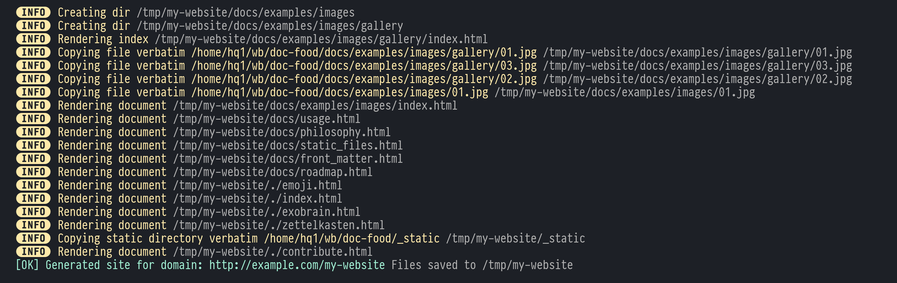

# Welcome to Writer's Block!

  - :heart: a personal wiki (or [[exobrain]]) engine for hackers
  - :notebook: ~~simplistic~~ opinionated markdown processor with [[zettelkasten]] flavor
  - :page_with_curl: minimalistic static site generator
  - :open_hands: open source and always free as in freedom

### Quick links:

  - [[installation]] and [[usage]] :rocket:
  - [[changelog]]
  - [[philosophy]] and [[use cases]]
  - [[features]] for general overview
  - [[ideas|Ideas]] for _maybe_ upcoming features. Would you
    like to [[contribute|contribute]]?
  - [[docs|Documentation]] for specific topics
  - [[license]]

## Why?

Everyone needs to write their own static page generator and this one is special
 (just like every other one :angel:).

## Can I see a demo?

You're looking at it! `wb` dogfooding in action.

## Acknowledgements

 _In loving memory of MF DOOM_.

<iframe src="https://www.youtube.com/embed/nd8cys4Beh0?controls=0" frameborder="0" allow="accelerometer; autoplay; clipboard-write; encrypted-media; gyroscope; picture-in-picture" allowfullscreen></iframe>

